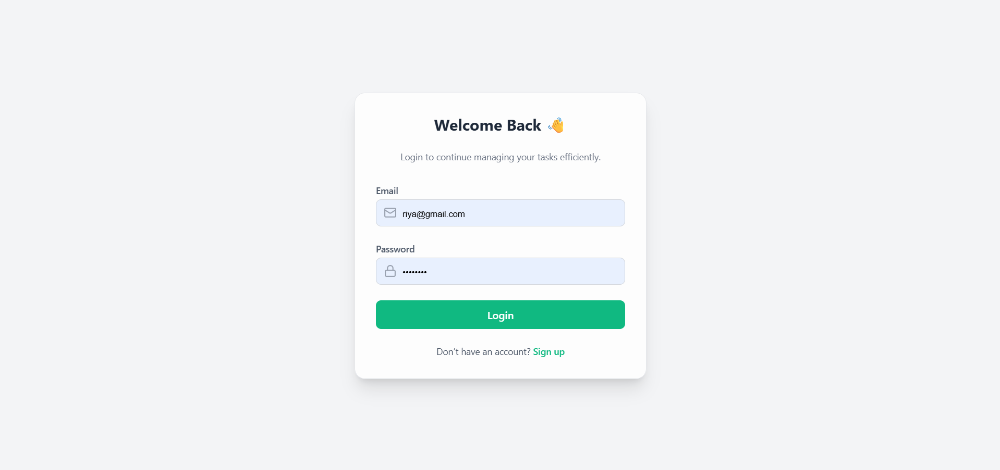
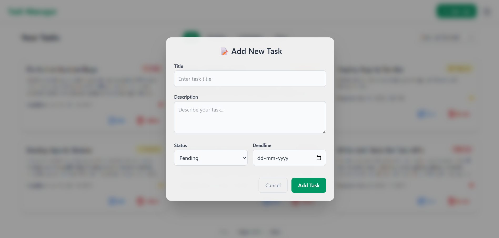
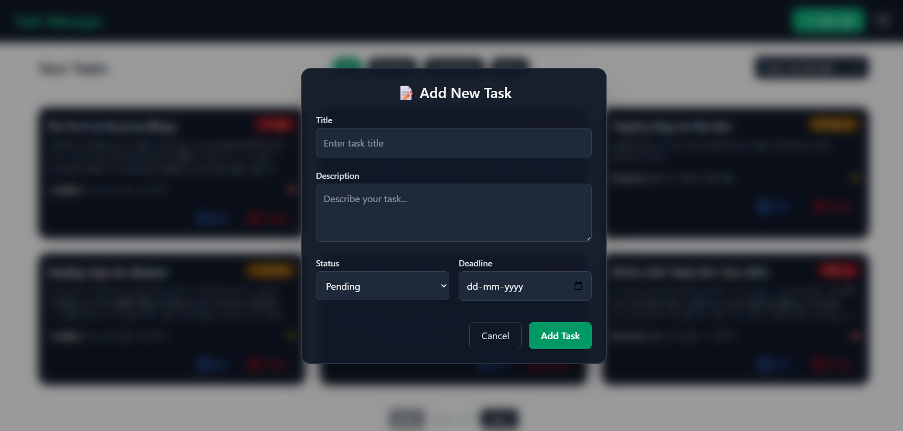
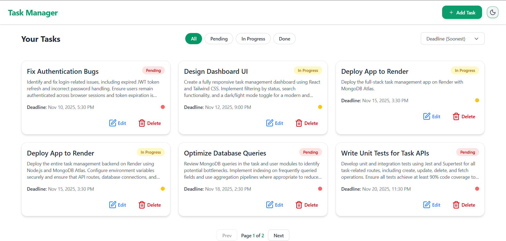
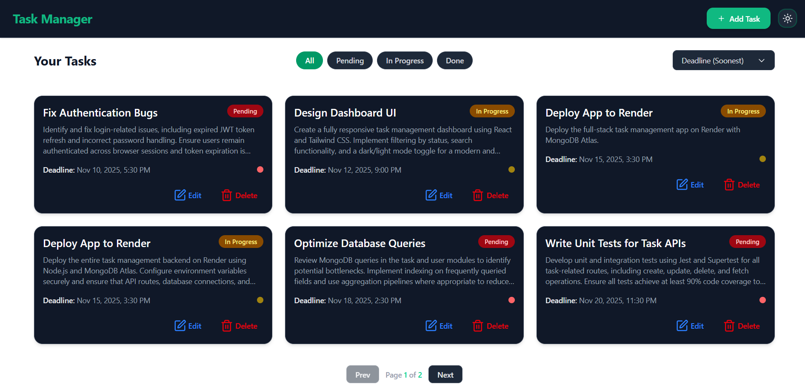

## Task Management Application

A **Task Management ** built with **React**, **TypeScript**, **Express**, and **MongoDB**, featuring **JWT Authentication**, **Dark/Light Mode**, and a clean modern UI.  

Users can **sign up, log in, and manage personal tasks** (create, view, update, and delete), with full authentication and persistent storage.

---

##  Setup & Installation

Follow these steps to set up and run the project locally on your machine 

---

###  1. Clone the Repository

```bash
git clone https://github.com/<your-username>/task-manager.git
```
###  2. Open a new terminal window and navigate to the frontend folder:

```bash
cd frontend
```

###  3. Install dependencies:

```bash
npm install
```

###  4. Run the frontend development server:

```bash
npm run dev
```

##  Features

### 🔐 Authentication
- User **signup and login** with email & password  
- **JWT-based authentication** for API security  
- Protected routes — only logged-in users can access their tasks  

###  Task Management
- **CRUD operations** (Create, Read, Update, Delete)  
- Each task includes:
  - 🏷️ Title  
  - 📝 Description  
  - 🚦 Status (*Pending / In Progress / Done*)  
  - 📅 Deadline date  
- **User-specific tasks** — each user can only access their own data  

###  UI Features
- 🌗 **Dark / Light mode** toggle  
- 🎯 **Filter & Sort Tasks** by status or date  
- ⚡ Responsive design (works on mobile & desktop)  
 

---

### 📸 Screens

#### 🔐 Auth Pages
**Login**


**Signup**


---

#### 📝 Add Task 
**Light Mode**


**Dark Mode**


#### 📝 All Tasks 
**Light Mode**


**Dark Mode**



